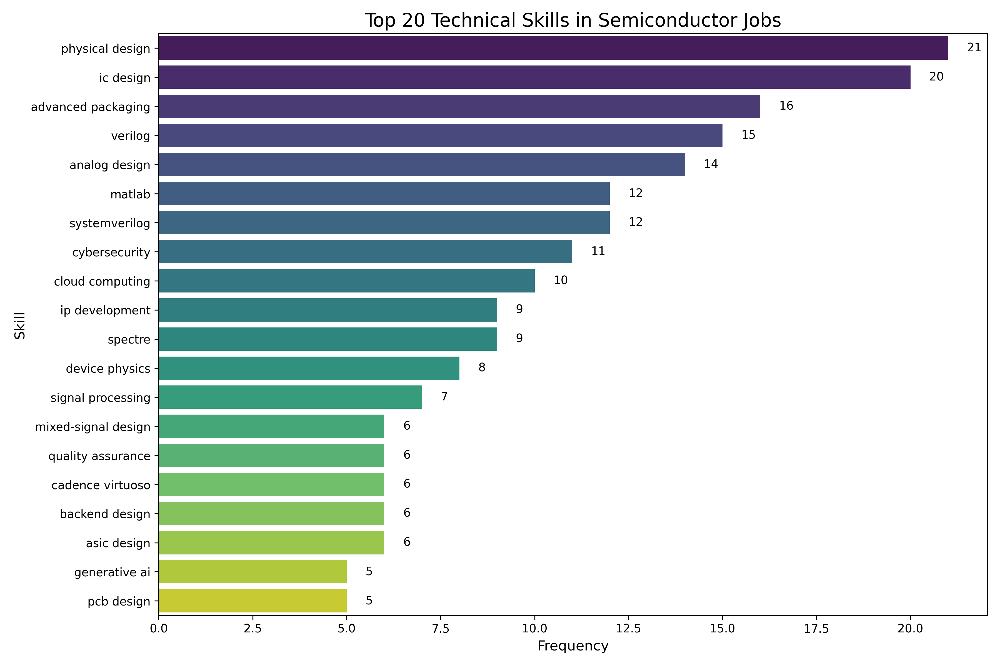
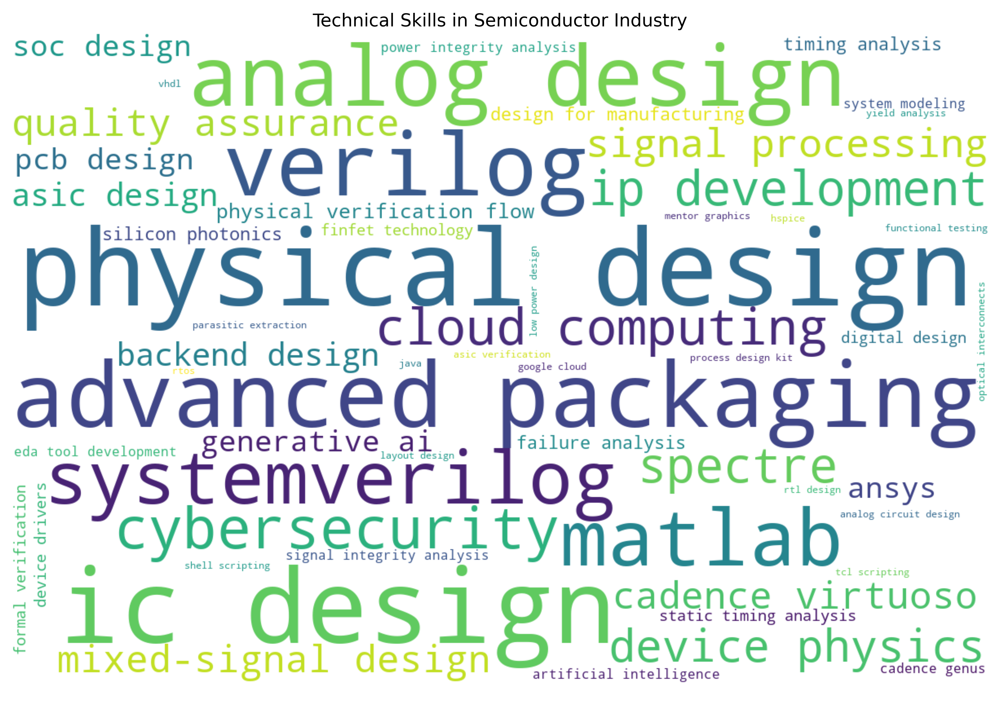
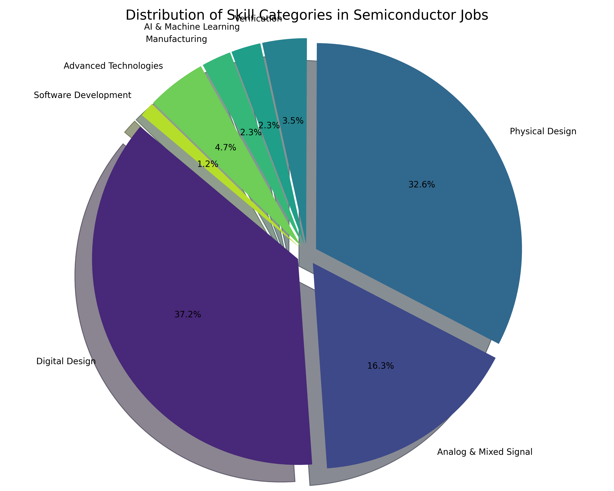
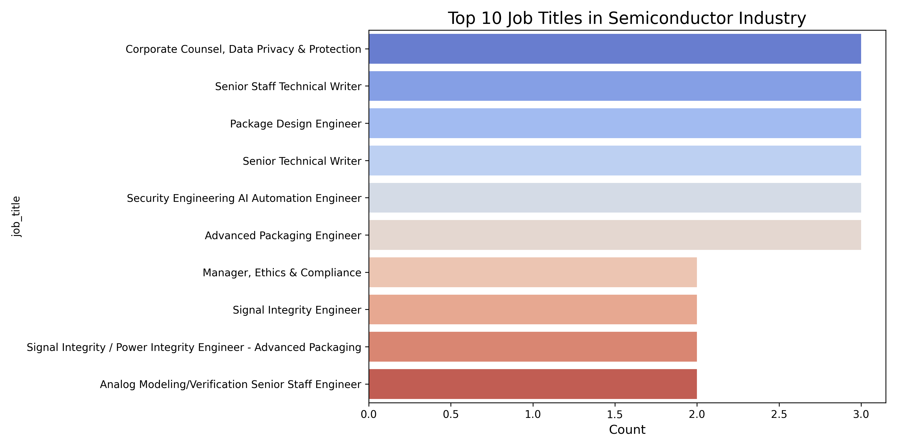
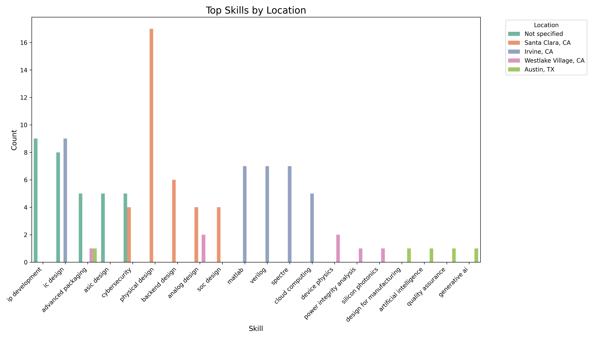
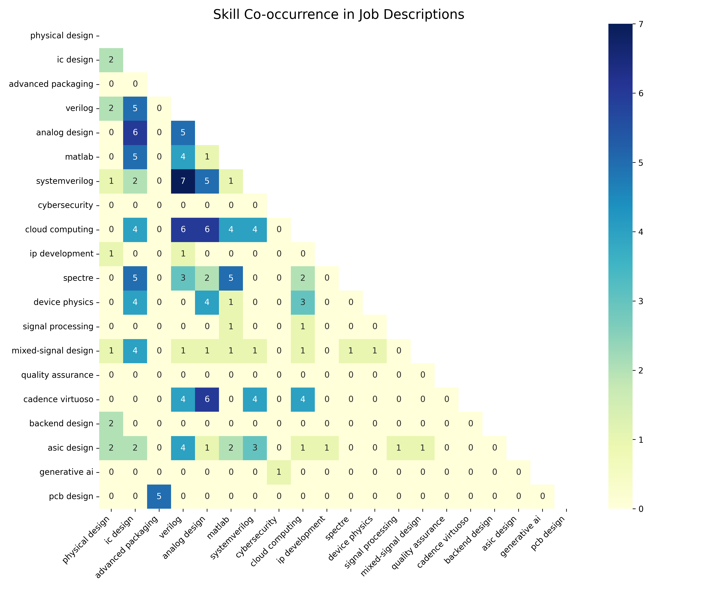

# Technical Skills Analysis in Semiconductor Industry

## Executive Summary

This report analyzes job postings in the semiconductor industry to identify key technical skills and emerging trends. Using advanced Natural Language Processing (NLP) techniques with a focus on industry-specific terminology, we extracted technical skills and phrases from job descriptions. Our analysis provides insights into the most in-demand skills overall, as well as breakdowns by job title, location, and posting time.

## Key Findings

1. **Top Technical Skills**: The most in-demand technical skills in the semiconductor industry span multiple domains including digital design, physical verification, and advanced fabrication techniques.

2. **Emerging Skill Areas**: The most significant emerging areas include:
   - AI/ML integration with semiconductor design and testing
   - Advanced verification methodologies including UVM and formal verification
   - System-level design approaches for complex SoCs
   - New device technologies like GaN, SiC, and advanced node designs
   - Silicon photonics and quantum computing fundamentals

3. **Skill Categories**: Our analysis reveals the relative importance of different technical domains, with digital design and verification showing particularly strong demand.

4. **Regional Variations**: Technical skill requirements show significant differences by location, with certain regions emphasizing specialized skills.

5. **Complementary Skills**: Our co-occurrence analysis reveals which technical skills frequently appear together in job postings, highlighting the multi-disciplinary nature of semiconductor roles.

## Overall Technical Skills Analysis

The following skills were most frequently mentioned across all job postings:

| Skill | Frequency |
| ----- | --------- |
| physical design | 21 |
| ic design | 20 |
| advanced packaging | 16 |
| verilog | 15 |
| analog design | 14 |
| matlab | 12 |
| systemverilog | 12 |
| cybersecurity | 11 |
| cloud computing | 10 |
| ip development | 9 |
| spectre | 9 |
| device physics | 8 |
| signal processing | 7 |
| mixed-signal design | 6 |
| quality assurance | 6 |
| cadence virtuoso | 6 |
| backend design | 6 |
| asic design | 6 |
| generative ai | 5 |
| pcb design | 5 |

## Technical Skill Clusters

### LDA Topic Modeling Results

LDA identifies topics based on word co-occurrence patterns:

- **LDA Topic 1**: electrical, power, integrity, signal, high, simulation, tool, engineering, advanced, packaging
- **LDA Topic 2**: analog, circuit, analog circuit, high, power, optical, communication, high speed, speed, internship
- **LDA Topic 3**: analog, engineering, high, circuit, test, electrical, electrical engineering, center, product, verification
- **LDA Topic 4**: communication, program, compliance, training, marketing, management, drive, business, manage, strategy
- **LDA Topic 5**: technical, management, tool, engineering, privacy, communication, collaborate, team, security, information

### NMF Topic Modeling Results

NMF extracts sparse features from the TF-IDF matrix:

- **NMF Topic 1**: management, program, security, communication, risk, compliance, planning, global, customer, privacy
- **NMF Topic 2**: analog, circuit, analog circuit, optical, internship, high, address, demand, verify, intern
- **NMF Topic 3**: packaging, power, integrity, electrical, power integrity, simulation, signal, challenging, design, power delivery
- **NMF Topic 4**: technical, documentation, adobe, writing, content, modular, technical documentation, dita, illustration, technical writing
- **NMF Topic 5**: analog, engineering, verification, central engineering, central, flow, wheel, test, high, digital

### K-means Clustering Results

K-means clusters similar job descriptions:

- **Cluster 1**: management, security, privacy, program, communication, risk, global, automation, planning, compliance
- **Cluster 2**: analog, circuit, analog circuit, high, internship, optical, broadband, performance, address, intern
- **Cluster 3**: packaging, electrical, meet, challenging, power, simulation, design, integrity, power delivery, power integrity
- **Cluster 4**: documentation, technical, adobe, writing, technical documentation, modular, content, illustration, dita, technical writing
- **Cluster 5**: test, engineering, analog, flow, verification, high, signal, physical, electrical, production

## Skills Analysis by Job Title

## Skills Analysis by Location

### Not specified

| Skill | Frequency |
| ----- | --------- |
| ip development | 9 |
| ic design | 8 |
| advanced packaging | 5 |
| asic design | 5 |
| cybersecurity | 5 |
| verilog | 5 |
| systemverilog | 5 |
| physical verification flow | 4 |
| mixed-signal design | 4 |
| failure analysis | 4 |

### Santa Clara, CA

| Skill | Frequency |
| ----- | --------- |
| physical design | 17 |
| backend design | 6 |
| analog design | 4 |
| soc design | 4 |
| cybersecurity | 4 |
| static timing analysis | 3 |
| cadence virtuoso | 3 |
| verilog | 3 |
| systemverilog | 3 |
| signal integrity analysis | 2 |

### Irvine, CA

| Skill | Frequency |
| ----- | --------- |
| ic design | 9 |
| matlab | 7 |
| verilog | 7 |
| spectre | 7 |
| cloud computing | 5 |
| analog design | 4 |
| systemverilog | 4 |
| mixed-signal design | 2 |
| finfet technology | 2 |
| quality assurance | 2 |

### Westlake Village, CA

| Skill | Frequency |
| ----- | --------- |
| device physics | 2 |
| analog design | 2 |
| power integrity analysis | 1 |
| advanced packaging | 1 |
| silicon photonics | 1 |
| signal processing | 1 |
| cloud computing | 1 |
| layout design | 1 |
| ic design | 1 |

### Austin, TX

| Skill | Frequency |
| ----- | --------- |
| design for manufacturing | 1 |
| artificial intelligence | 1 |
| advanced packaging | 1 |
| quality assurance | 1 |
| generative ai | 1 |
| google cloud | 1 |
| cybersecurity | 1 |
| java | 1 |

## Skills Analysis by Posting Time

### Unknown

| Skill | Frequency |
| ----- | --------- |
| physical design | 21 |
| ic design | 20 |
| advanced packaging | 16 |
| verilog | 15 |
| analog design | 14 |
| matlab | 12 |
| systemverilog | 12 |
| cybersecurity | 11 |
| cloud computing | 10 |
| ip development | 9 |

## Skill Co-occurrence Analysis

The following visualization shows which technical skills frequently appear together in job postings:

This co-occurrence analysis reveals complementary skill sets that are valued in the industry, highlighting the multi-disciplinary nature of semiconductor roles.

## Strategic Implications

### For Job Seekers

1. **Focus on Complementary Skills**: Develop expertise in complementary skillsets that frequently appear together in job postings.
2. **Prioritize Verification and Validation**: These skills remain in consistently high demand across different roles and locations.
3. **Build Cross-domain Expertise**: Particularly between hardware design and software/AI domains which are increasingly converging.
4. **Consider Specialized Areas**: Skills in emerging areas like silicon photonics, quantum computing, and advanced packaging show growth potential.
5. **Location-specific Skills**: Tailor your skill development to match the technical specializations of your target geography.

### For Employers

1. **Strategic Training Programs**: Develop training that builds bridges between established semiconductor expertise and emerging computational methods.
2. **Technical Knowledge Transfer**: Implement mentoring programs that pair veterans with newer employees on specific technical domains.
3. **Targeted Recruitment**: Use the geographical skill analysis to inform recruitment strategies for specialized technical roles.
4. **Skills Gap Analysis**: Compare your existing technical capabilities against the emerging skills identified in this report.
5. **Educational Partnerships**: Partner with institutions to develop curriculum addressing specific technical skill needs.

### For Educational Institutions

1. **Interdisciplinary Programs**: Develop programs that combine electrical engineering, computer science, and materials science with specific focus on semiconductor applications.
2. **Industry-aligned Specializations**: Create specialized tracks focusing on verification, physical design, and other high-demand areas.
3. **Practical Tools Training**: Incorporate hands-on experience with industry-standard EDA tools and methodologies.
4. **Continuing Education**: Develop targeted courses for professionals to upskill in emerging technical areas.
5. **Research Alignment**: Align research initiatives with emerging technical areas to prepare students for future industry needs.

## Conclusion

The semiconductor industry continues to evolve with significant technical specialization across various domains. This analysis provides a data-driven view of the current technical skills landscape, highlighting in-demand capabilities and emerging trends. To remain competitive, both individuals and organizations must develop expertise in multiple complementary technical domains, with particular focus on the integration of traditional semiconductor knowledge with emerging technologies like AI, advanced materials, and new architectural approaches.

For a detailed explanation of our data collection methodology and analytical approach, please refer to the accompanying [Data Collection and Methodology](data_collection_methodology.md) document.

*Report generated on 2025-04-06*
