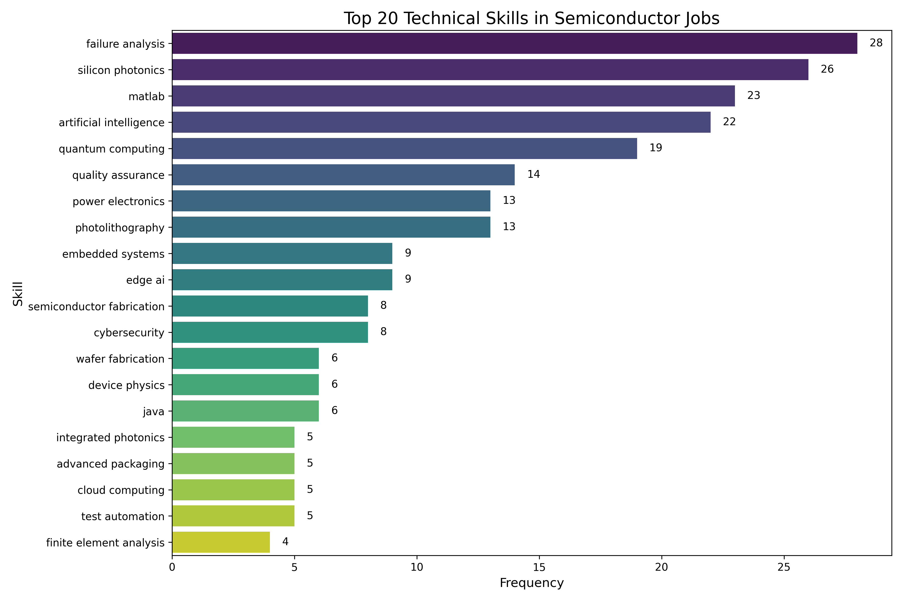
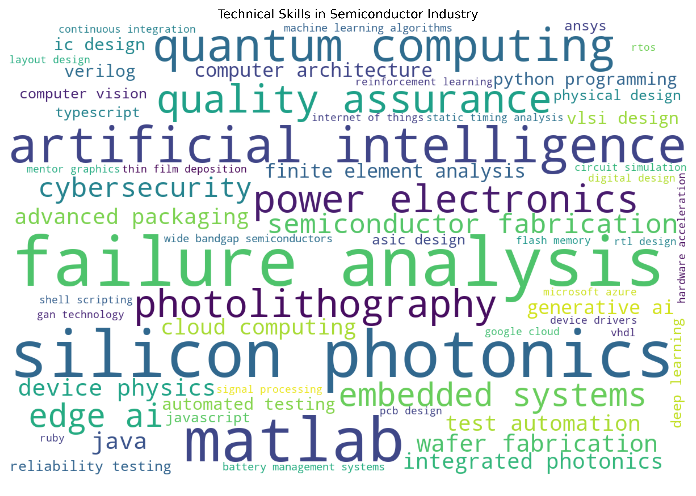
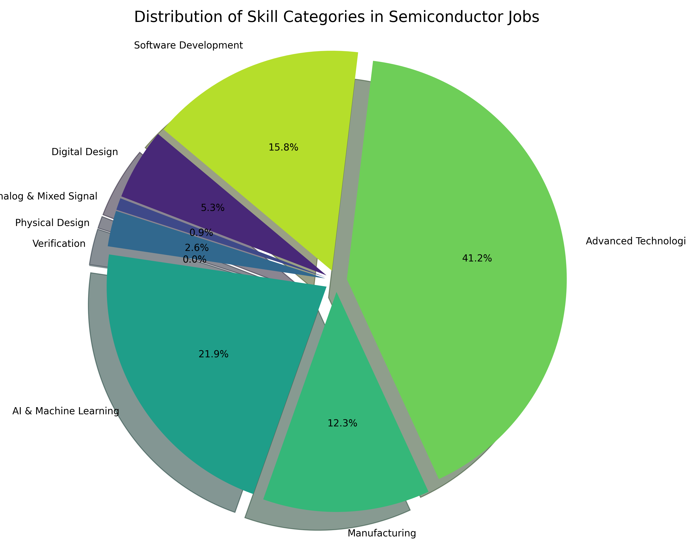
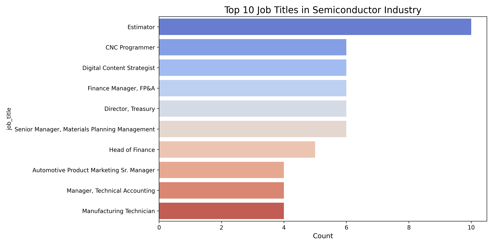
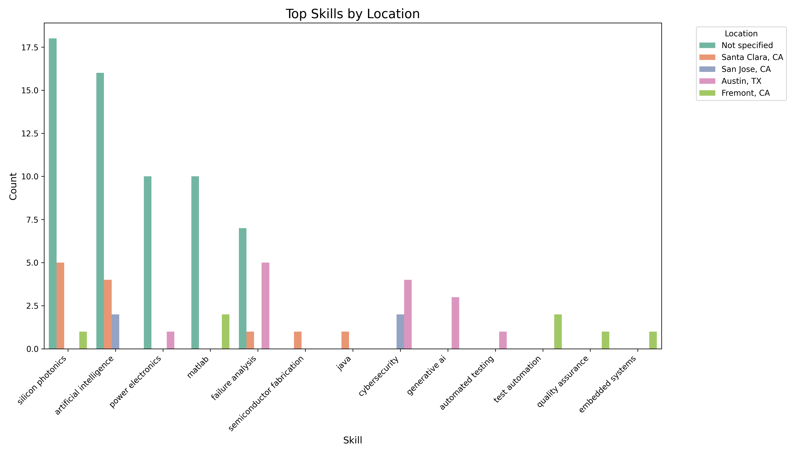
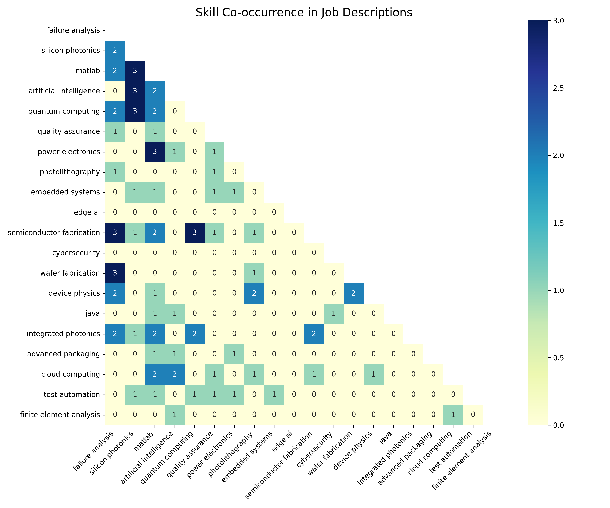

# Technical Skills Analysis in Semiconductor Industry

## Executive Summary

This report analyzes job postings in the semiconductor industry to identify key technical skills and emerging trends. Using advanced Natural Language Processing (NLP) techniques with a focus on industry-specific terminology, we extracted technical skills and phrases from job descriptions. Our analysis provides insights into the most in-demand skills overall, as well as breakdowns by job title, location, and posting time.

## Key Findings

1. **Top Technical Skills**: The most in-demand technical skills in the semiconductor industry span multiple domains including digital design, physical verification, and advanced fabrication techniques.

2. **Emerging Skill Areas**: The most significant emerging areas include:
   - AI/ML integration with semiconductor design and testing
   - Advanced verification methodologies including UVM and formal verification
   - System-level design approaches for complex SoCs
   - New device technologies like GaN, SiC, and advanced node designs
   - Silicon photonics and quantum computing fundamentals

3. **Skill Categories**: Our analysis reveals the relative importance of different technical domains, with digital design and verification showing particularly strong demand.

4. **Regional Variations**: Technical skill requirements show significant differences by location, with certain regions emphasizing specialized skills.

5. **Complementary Skills**: Our co-occurrence analysis reveals which technical skills frequently appear together in job postings, highlighting the multi-disciplinary nature of semiconductor roles.

## Overall Technical Skills Analysis

The following skills were most frequently mentioned across all job postings:

| Skill | Frequency |
| ----- | --------- |
| failure analysis | 28 |
| silicon photonics | 26 |
| matlab | 23 |
| artificial intelligence | 22 |
| quantum computing | 19 |
| quality assurance | 14 |
| power electronics | 13 |
| photolithography | 13 |
| embedded systems | 9 |
| edge ai | 9 |
| semiconductor fabrication | 8 |
| cybersecurity | 8 |
| wafer fabrication | 6 |
| device physics | 6 |
| java | 6 |
| integrated photonics | 5 |
| advanced packaging | 5 |
| cloud computing | 5 |
| test automation | 5 |
| finite element analysis | 4 |

## Technical Skill Clusters

### LDA Topic Modeling Results

LDA identifies topics based on word co-occurrence patterns:

- **LDA Topic 1**: kla, process, pay, status, finance, device, team, service, state, financial
- **LDA Topic 2**: strategy, content, engineering, marketing, executive, business, sale, high, management, digital
- **LDA Topic 3**: supply, management, material, chain, supply chain, data, group, process, technology, engineering
- **LDA Topic 4**: process, manufacturing, engineering, quality, equipment, material, program, optical, test, coherent
- **LDA Topic 5**: accounting, business, process, technical, status, range, paid, medical, disability, application

### NMF Topic Modeling Results

NMF extracts sparse features from the TF-IDF matrix:

- **NMF Topic 1**: process, engineering, manufacturing, test, quality, range, group, new, data, technical
- **NMF Topic 2**: kla, finance, financial, device, interview, pay, service, acquisition, process, posting
- **NMF Topic 3**: coherent, coherent corp, corp, optical, recruiter employment, ehs, recruiter employment agency, employment agency, writing, agency
- **NMF Topic 4**: bid, estimating, construction, mechanical, timely, estimate, federal, state, contract, document
- **NMF Topic 5**: content, supply, strategy, financial, chain, supply chain, management, accounting, treasury, leadership

### K-means Clustering Results

K-means clusters similar job descriptions:

- **Cluster 1**: accounting, business, process, status, bid, paid, range, engineering, sale, client
- **Cluster 2**: process, manufacturing, engineering, quality, material, test, device, supply, management, data
- **Cluster 3**: kla, finance, device, interview, pay, service, acquisition, financial, process, program
- **Cluster 4**: content, investor, strategy, marketing, nxp, financial, journey, content strategy, digital, space
- **Cluster 5**: coherent, coherent corp, corp, optical, recruiter employment agency, recruiter employment, ehs, employment agency, environmental, agency

## Skills Analysis by Job Title

### Estimator

| Skill | Frequency |
| ----- | --------- |

### CNC Programmer

| Skill | Frequency |
| ----- | --------- |

### Digital Content Strategist

| Skill | Frequency |
| ----- | --------- |

### Finance Manager, FP&A

| Skill | Frequency |
| ----- | --------- |

### Director, Treasury

| Skill | Frequency |
| ----- | --------- |
| edge ai | 6 |

### Senior Manager, Materials Planning Management

| Skill | Frequency |
| ----- | --------- |
| artificial intelligence | 6 |

### Head of Finance

| Skill | Frequency |
| ----- | --------- |

## Skills Analysis by Location

### Not specified

| Skill | Frequency |
| ----- | --------- |
| silicon photonics | 18 |
| artificial intelligence | 16 |
| power electronics | 10 |
| matlab | 10 |
| failure analysis | 7 |
| quantum computing | 6 |
| embedded systems | 6 |
| advanced packaging | 5 |
| edge ai | 5 |
| computer architecture | 4 |

### Santa Clara, CA

| Skill | Frequency |
| ----- | --------- |
| silicon photonics | 5 |
| artificial intelligence | 4 |
| semiconductor fabrication | 1 |
| failure analysis | 1 |
| java | 1 |

### San Jose, CA

| Skill | Frequency |
| ----- | --------- |
| artificial intelligence | 2 |
| cybersecurity | 2 |

### Austin, TX

| Skill | Frequency |
| ----- | --------- |
| failure analysis | 5 |
| cybersecurity | 4 |
| generative ai | 3 |
| power electronics | 1 |
| automated testing | 1 |
| ic design | 1 |
| matlab | 1 |
| verilog | 1 |
| java | 1 |

### Fremont, CA

| Skill | Frequency |
| ----- | --------- |
| test automation | 2 |
| matlab | 2 |
| silicon photonics | 1 |
| quality assurance | 1 |
| embedded systems | 1 |
| ic design | 1 |
| photolithography | 1 |

### United States

| Skill | Frequency |
| ----- | --------- |
| quantum computing | 7 |
| integrated photonics | 4 |
| edge ai | 3 |
| failure analysis | 2 |
| semiconductor fabrication | 1 |
| digital design | 1 |
| matlab | 1 |

### Milpitas, CA

| Skill | Frequency |
| ----- | --------- |
| failure analysis | 3 |
| photolithography | 1 |

## Skills Analysis by Posting Time

### Unknown

| Skill | Frequency |
| ----- | --------- |
| failure analysis | 28 |
| silicon photonics | 26 |
| matlab | 23 |
| artificial intelligence | 22 |
| quantum computing | 19 |
| quality assurance | 14 |
| power electronics | 13 |
| photolithography | 13 |
| embedded systems | 9 |
| edge ai | 9 |

## Skill Co-occurrence Analysis

The following visualization shows which technical skills frequently appear together in job postings:

This co-occurrence analysis reveals complementary skill sets that are valued in the industry, highlighting the multi-disciplinary nature of semiconductor roles.

## Strategic Implications

### For Job Seekers

1. **Focus on Complementary Skills**: Develop expertise in complementary skillsets that frequently appear together in job postings.
2. **Prioritize Verification and Validation**: These skills remain in consistently high demand across different roles and locations.
3. **Build Cross-domain Expertise**: Particularly between hardware design and software/AI domains which are increasingly converging.
4. **Consider Specialized Areas**: Skills in emerging areas like silicon photonics, quantum computing, and advanced packaging show growth potential.
5. **Location-specific Skills**: Tailor your skill development to match the technical specializations of your target geography.

### For Employers

1. **Strategic Training Programs**: Develop training that builds bridges between established semiconductor expertise and emerging computational methods.
2. **Technical Knowledge Transfer**: Implement mentoring programs that pair veterans with newer employees on specific technical domains.
3. **Targeted Recruitment**: Use the geographical skill analysis to inform recruitment strategies for specialized technical roles.
4. **Skills Gap Analysis**: Compare your existing technical capabilities against the emerging skills identified in this report.
5. **Educational Partnerships**: Partner with institutions to develop curriculum addressing specific technical skill needs.

### For Educational Institutions

1. **Interdisciplinary Programs**: Develop programs that combine electrical engineering, computer science, and materials science with specific focus on semiconductor applications.
2. **Industry-aligned Specializations**: Create specialized tracks focusing on verification, physical design, and other high-demand areas.
3. **Practical Tools Training**: Incorporate hands-on experience with industry-standard EDA tools and methodologies.
4. **Continuing Education**: Develop targeted courses for professionals to upskill in emerging technical areas.
5. **Research Alignment**: Align research initiatives with emerging technical areas to prepare students for future industry needs.

## Conclusion

The semiconductor industry continues to evolve with significant technical specialization across various domains. This analysis provides a data-driven view of the current technical skills landscape, highlighting in-demand capabilities and emerging trends. To remain competitive, both individuals and organizations must develop expertise in multiple complementary technical domains, with particular focus on the integration of traditional semiconductor knowledge with emerging technologies like AI, advanced materials, and new architectural approaches.

For a detailed explanation of our data collection methodology and analytical approach, please refer to the accompanying [Data Collection and Methodology](data_collection_methodology.md) document.

*Report generated on 2025-04-06*
